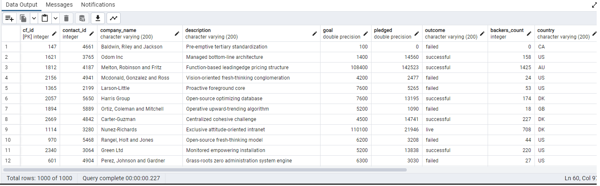
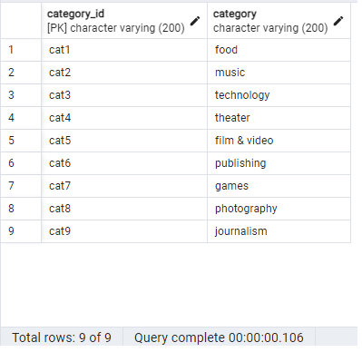
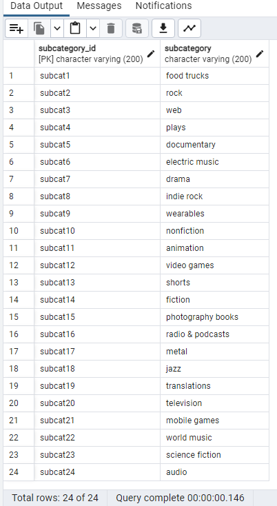

# Crowdfunding_ETL
*Bootcamp: UPENN-VIRT-DATA-PT-06-2023-U-LOLC-MTTH Project 2: ETL*

## Description
This project is an example of the ETL (Extract, Transform, Load) workflow for using Python, Jupyter, and PostgreSQL.
It intakes two Excel workbooks with one spreadsheet each, generates DataFrames using Pandas, and produces the schema for loading them into a Postgres database.

The data that is run through this workflow is comprised of crowdfunding information for a variety of generated (as in not real) projects.

## Installation/Instructions
### Requirements
This project was run using the following packages.
It may work on older or newer version, but has not been tested.

python 3.10.12
jupyter 1.0.0
numpy 1.24.3
pandas 1.5.3
json5 0.9.14
postgresql 14.9
pgadmin4 7.6

### Installation
To clone this repo, use the following command: `git clone https://github.com/4a6166/Crowdfunding_ETL.git`

### How to Run
Input files are located in the [Resources](Resources) directory:
- contacts.xlsx
- crowdfunding.xlsx

The [notebook file](ETL_Mini_Project_JField_RMatsui_HWhang.ipynb) may be examined using Jupyter Notebook or Lab, VSCode, or Github's Jupyter viewer.

To generate the database, create a database and use [crowdfunding_db_schema.sql](crowdfunding_db_schema.sql) to create the tables.
CSV files were generated from the Jupyter Notebooks.
The files may be loaded into the respective tables using psql commands (ex: `psql -c "\copy campaign FROM '/Resources/campaign.csv' delimiter ',' csv"`) or pgAdmin.

### Output
The [notebook file](ETL_Mini_Project_JField_RMatsui_HWhang.ipynb) runs the E and T parts of ETL.
It outputs four CSVs, which are located in the [Resources](Resources) directory.

The [crowdfunding_db_schema.sql](crowdfunding_db_schema.sql) file may be used to generate a database with PostgreSQL.
Screenshots of the database are below:

Campaign Table

Category Table

Contact Table

Subcategory Table

## Credits
This project was a collaboration between Jacob Field, Sung Im (Hannah) Whang, and Ryodai (Peter) Matsui.

Data for this dataset was generated by edX Boot Camps LLC, and is intended for educational purposes only.

## License
[MIT](LICENSE)
